# wincc-unified-on-IE-pub-sub-databus

## Overview

This application sample describes the procedure to publish variables from WinCC Unified Runtime for Industrial Edge on our Industrial Edge Databus. The Industrial Edge application “WinCC Unified Runtime” is capable to publish their HMI-tags on the Industrial Edge Databus so that another Industrial Edge application can read and write the value. This solution can be achieved by the Industrial Edge application “Flow Creator”. Beside the documentation part, we will also provide you a predefined flow for the “Flow Creator” – Application via this application sample. 
As an example, we are explaining the approach and the configuration with the help of an Industrial Edge connector, like OPC UA connector. The engineering for our WinCC Unified application is made in TIA Portal.

The following figure provides an overview of the architecture.

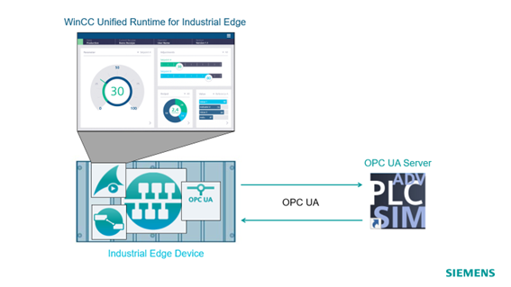

## Solution approach

Exchanging data between different Industrial Edge applications can be achieved via the Industrial Edge Databus (MQTT-Broker). Each Industrial Edge application publish their data on the Industrial Edge Databus with an app-specific MQTT-topic.
So for example, WinCC Unified Runtime for Industrial Edge uses following MQTT topic:

```
ie/d/j/simatic/v1/ue1/…
```

The data from Industrial Edge OPC UA Connector for example is published under:

```
ie/d/j/simatic/v1/opcua1/..
```

The solution proposed by this application sample offers you a flow for the “Flow Creator” application, which transfers the values from one MQTT topic to another one and vice versa.

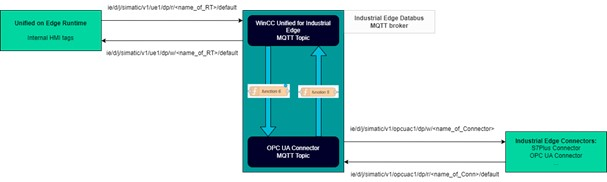

## Prerequisites

### 1. Set up an Industrial Edge Device

In order to make this application example work, an IE device needs to be onboarded and ready. There is a complete explanation on how to onboard and get the IED ready in the [Industrial Edge webpage](https://docs.eu1.edge.siemens.cloud/index.html). Apart from that it is required that the following Edge Apps are installed:
1.	WinCC Unified Runtime
2.	Flow Creator
3.	Common Configurator
4.	Databus
5.	OPC UA Connector
6.	Registry Service
   
### 2. Import CopyValuesFlow_v3.json to Flow Creator

The Industrial Edge Flow Creator (IE Flow Creator) application is a web browser-based programming tool that works on any platform. It is used to develop and deploy software services to hardware devices. This browser-based application is an editor that is designed for the Internet of Things.

For this application example, Flow Creator is used to act as the core of the system. The requirement is to have this app installed, you can check how to install the app and further information in [this SIOS entry](https://support.industry.siemens.com/cs/document/109807382/industrial-edge-flow-creator-v1-3-3?dti=0&lc=en-WW). You can check how to import flows (CopyValuesFlow_v3.json) in official NodeRED documentation.

### 3. PLC-Project downloaded into PLC-SimAdvanced / PLC

The PLC code contain the functions that are used to modify the values. In the PLC project, the OPC UA server is enabled as it is used to publish the values to the Databus. 

The user needs to create a new PLC instance where the Online Access is set to TCP/IP Single Adapter and the instance has an IP address and a subnet mask that belong to the same network where the IE Device is connected. When the PLC instance is online, download the PLC code from [the project](https://github.com/industrial-edge/miscellaneous/blob/main/tank%20application/tia-tank-application.zap19).

### 4. Set up OPC UA Connector

Once the PLC is in RUN mode, the OPC UA server is up and the OPC UA Connector from the IE Device should be able to find it. This OPC UA Connector  is used to gather the data from the OPC UA server. In order to configure this connection, please follow the configuration steps under the following [link](https://github.com/industrial-edge/opc-ua-application-getting-started/blob/main/docs/Installation.md#configure-OPC-UA-connector).

### 5. UoE project downloaded into UoE RT app

The WinCC Unified Runtime for Industrial Edge contains the visible part of this project. It consists of a screen where several IO fields display some values from the PLC. 
To do so, you need to [download](https://github.com/industrial-edge/wincc-unified-on-IE/blob/main/docs/installation_and_tutorial.md#load-a-project-into-runtime) the WinCC Unified device from [the project](https://github.com/industrial-edge/miscellaneous/blob/main/tank%20application/tia-tank-application.zap19) into the IE Device, open the WinCC Unified Runtime app and click on the settings of the project. 

### 6. Configure WinCC Unified Runtime settings (Enable services & browse tags)

Make sure that this services are activated as well as the Databus credentials (which were configured in step 4) are typed and save.

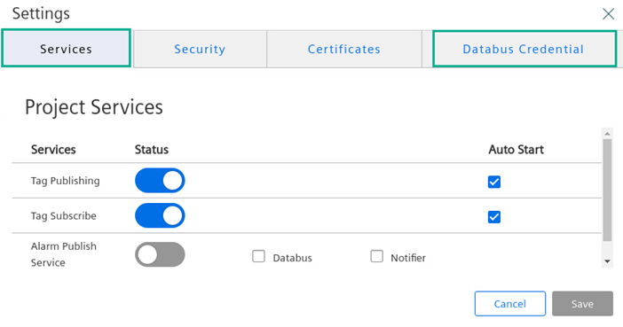

>Note: Notice that to access the WinCC Unified Runtime app you need to enter the credentials of the project (The credentials are located in TIA Portal under “EdgeHowTos_V19” -> “Security settings” -> “Users and roles”). It is important to know that the current user admin credentials need to be overwritten, this can be achieved in the “Load preview” dialogue before downloading the project under “Runtime values” -> Uncheck the option “Keep current user administration data in runtime”.

Once the tag publishing and subscribe are enabled, check the settings of the WinCC Unified Runtime app and select the tags you are working with and click save.

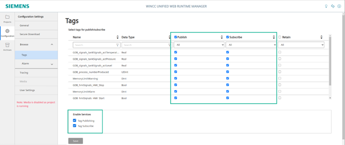

## How to implement the provided solution?

**WinCC Unified for Industrial Edge topic**

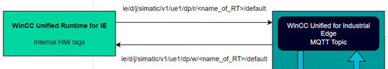

According to the Figure **above**, the topics that WinCC Unified for IE uses are:
-	**Publish**: ie/d/j/simatic/v1/ue1/dp/w/<name_of_RT>/default
-	**Subscribe**: ie/d/j/simatic/v1/ue1/dp/r/<name_of_RT>/default

The <name_of_RT>, which is the name of the Runtime, is available within the WinCC Unified Runtime app on your edge device. In this case, the <name_of_RT> is set to **EdgeHowTos_V19**

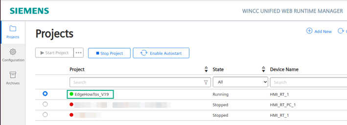

To adapt this to each use case, a change in the topic of the Flow Creator’s MQTT nodes is needed, specifically in the MQTT nodes **Read metadata UoE RT** & **Read values from UoE RT**. To do so, open the node’s settings and replace <name_of_RT> with the name of the project used, for this example would be:

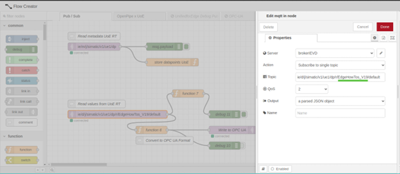

**OPC UA Connector**

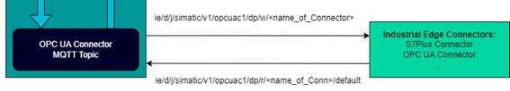

According to the Figure **above**, the topics that WinCC Unified for IE uses are:
-	**Publish**: ie/d/j/simatic/v1/opcuac1/dp/w/<name_of_Conn>
-	**Subscribe**: ie/d/j/simatic/v1/opcuac1/dp/r/<name_of_Conn>/default

 
Subsequently, the <name_of_Conn>, representing the connector utilized, can be located within the Common Configurator application on your edge device. If a connector has not yet been configured, you have the option to assign a name during the connection setup process. In this instance, the <name_of_Conn> is designated as **tankOPC**.

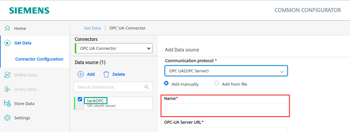

To adapt this to each use case, a change in the topic of the Flow Creator’s MQTT nodes is needed, specifically in the MQTT nodes **Read metadata from OPC UA Conn** & **Read values from OPC UA Conn**. To do so, open the node’s settings and replace <name_of_Conn> with the name of the project used, for this example would be:

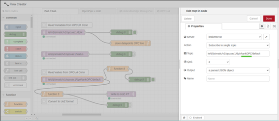

**Flow Creator**

After importing the flow into Flow Creator, as it is explained in the documentation link at the [Prerequisites](#prerequisites) in the Flow Creator description, you need to change some configuration in the following nodes:

As pointed in the chapter [How To Implement the provided solution](#how-to-implement-the-provided-solution) of this document, replace the <name_of_Conn> in the topic of the following nodes:
- Node Read metadata from OPC UA Conn
- Node Read values from OPC UA Conn

And replace the <name_of_RT> the following nodes:
- Node Read metadata UoE RT
- Node Read values from UoE RT

Last but not least, you need to import the Databus credentials to the mqtt nodes, to do so, open the settings of any mqtt node and edit the broker configuration:

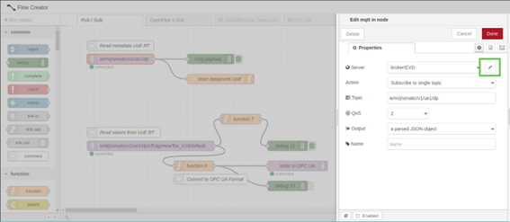

Once you are in the Edit mqtt-broker node window, open the Security tab and enter the Databus credentials:

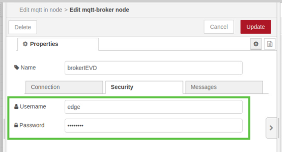

## Technical insights of the communication

**Communication between Databus and Connector**

This part of the flow connects the IE Databus to the IE Connector, in this case, the chosen connector for this example is the OPC UA Connector. It consists of two sections:

>NOTE:	This flow belongs to the attached file CopyValuesFlow_v3.json  which needs to be imported in the Flow Cleator Edge app.

1.	"Read metadata from OPC UA Conn": This section gathers all available tag information, including IDs and topics from OPC UA Connector.
2.	"Read values from OPC UA Conn": Here, the flow captures the most recent value for each tag whenever there is a change. It then adjusts the payload structure using WinCC Unified ID and topic within function 5 and sends the updated value to the WinCC Unified topic via the MQTT out node.

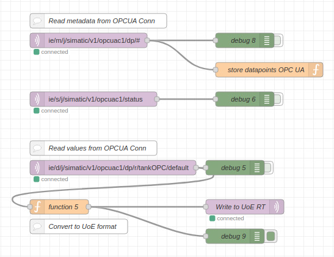

>ReadMe: How can I adapt this flow to my Use Case?
As pointed in the Chapter 2.2 of this document, replace the <name_of_Conn> in the topic of the following nodes: 
>- Node Read metadata from OPC UA Conn
>- Node Read values from OPC UA Conn

In further detail, the "store datapoints OPC UA" function within the flow saves two crucial pieces of information:
1.	The dataPointDefinitions of each tag, which includes the data type, ID, and name associated with it.
2.	The WinCC Unfied topic to write.

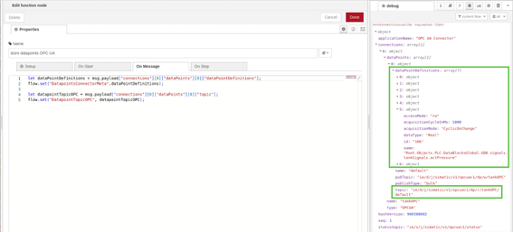

The main task of function 5 serves to map the metadata of the received tag from the OPC UA Connector, locate the corresponding HMI tag, prepare a write command to update the HMI tag with the latest value obtained from OPC UA Connector, and then send this command. In practical terms, it receives the new value from OPC UA Connector (highlighted in green in the picture), identifies the HMI tag ID, and writes the new value along with the ID to the WinCC Unified topic.

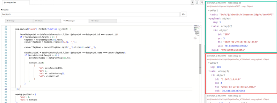

>Note: It is important to keep the name of the HMI tags as they are named after drag and drop from the PLC to the PC in TIA Portal. Then, set the connection of the tag to Internal Tag and delete the connection created in Devices & Networks -> Connections

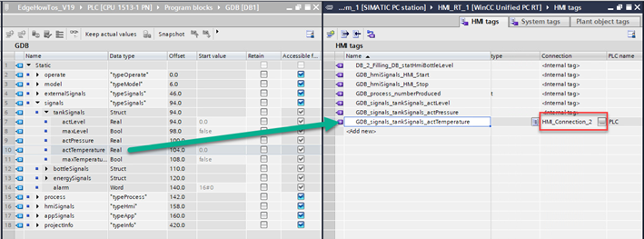

**Communication between Databus and WinCC Unified for IE**

This part of the flow connects the WinCC Unified Runtime for IE to the IE Databus. It consists of two sections:

1.	"Read metadata from UoE RT": This section gathers all available tag information, including IDs and topics from WinCC Unified Runtime.
2.	"Read values from UoE RT": Here, the flow captures the most recent value for each tag whenever there is a change. It then adjusts the payload structure using OPC UA ID and topic within function 6 and sends the updated value to the OPC UA topic via the MQTT out node.

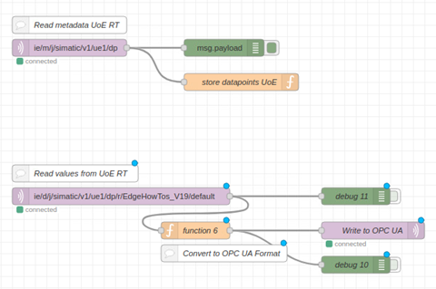
 
>ReadMe: How can I adapt this flow to my Use Case?
As pointed in the Chapter 2.2 of this document, replace the <name_of_RT> the following nodes:
>- Node Read metadata UoE RT
>- Node Read values from UoE RT

The store datapoints UoE and function 6 functions work similar to the matching functions in previous use case but the other way around. Retrieving the values from the WinCC Unified Runtime and writing them into the OPC UA Connector.

## Examples

### Metadata

Metadata summarizes basic information about data, making finding and working with particular instances of data easier. It doesn’t tell you what the content is, but instead describes the type of thing that it is. We map metadata from the OPC UA and WinCC Unified Runtime connection to find its match, since the id is different, but the naming is quite similar.


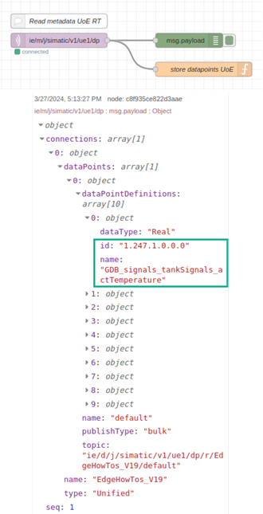

### From OPC UA Connector to WinCC Unified for IE RT

This is an example of a message received from the OPC UA connector, and the message published to the WinCC Unified Runtime.

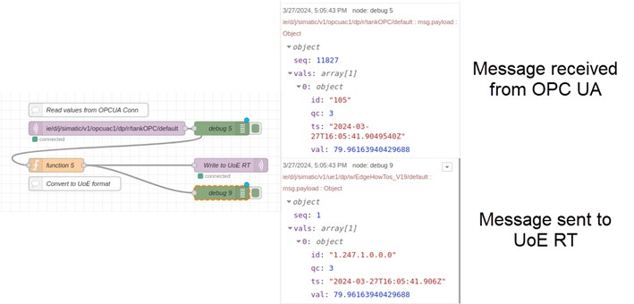

### From WinCC Unified for IE RT to OPC UA Connector 

This is an example of a message received from the WinCC Unified Runtime, and the message published to the OPC UA connector.

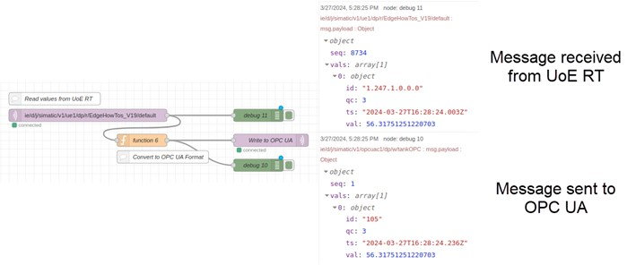

## Contribution

Thank you for your interest in contributing. Anybody is free to report bugs, unclear documentation, and other problems regarding this repository in the Issues section.
Additionally everybody is free to propose any changes to this repository using Pull Requests.

If you haven't previously signed the [Siemens Contributor License Agreement](https://cla-assistant.io/industrial-edge/) (CLA), the system will automatically prompt you to do so when you submit your Pull Request. This can be conveniently done through the CLA Assistant's online platform. Once the CLA is signed, your Pull Request will automatically be cleared and made ready for merging if all other test stages succeed.

## License and Legal Information

Please read the [Legal information](LICENSE.txt).

## Authors and acknowledgment

Hoz Torre, Jose Ramon (DI FA S SUP PTS)

Kuhla, Andreas (DI CS SD EH FA 5)


